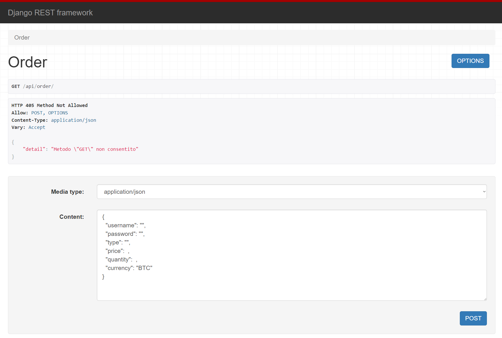

# Start2Impact: exchange-API


## Descrizione  
Exchange-API è un progetto di un exchange che funziona tramite API, sviluppato con Django e MongoDB. L'API consente agli utenti di scambiare valute digitali in modo sicuro e affidabile.

### [Presentazione](https://www.canva.com/design/DAFgtwbLMEo/J7SMXxoqk8Kkpfq4wrmmPQ/view?utm_content=DAFgtwbLMEo&utm_campaign=designshare&utm_medium=link&utm_source=publishsharelink)

## Utilizzo dell'API
Le richieste possono essere inviate tramite programmi come Postman o direttamente dall'interfaccia di Restframework dal browser.

Per creare un nuovo ordine o modificarlo, o visualizzare le informazioni dell'utente, è necessaria l'autenticazione. L'autenticazione può essere effettuata tramite le credenziali (username, password) o tramite l'utilizzo di un Token.

L'API prevede tre tipologie di ordini: attivi, inattivi ed eseguiti.
<br>

## Urls API
- '/api/user/': Visualizzazione dei dettagli dell'utente, con filtro per il tipo di stato degli ordini o singolo ordine
  ```json
  {
    "status": "",
    "id": ""
  }
  ```
- '/api/login/': Login di un utente esistente
  ```json
  {
    "username": "",
    "password": ""
  }
  ```
- '/api/register/': Registrazione di un nuovo utente
  ```json
  {
    "username": "",
    "password": "",
    "email": "",
    "first_name": "",
    "last_name": ""
  }
  ```
- '/api/order/': Aggiunta di un nuovo ordine di scambi
  ```json
  {
    "username": "",
    "password": "",
    "type": "",
    "price":  ,
    "quantity":  ,
    "currency": "BTC"
  }
  ```
- '/api/order/change/': Disattivare o attivare un ordine di scambio
  ```json
  {
    "username": "",
    "password": "",
    "status": "",
    "id": ""
  }
  ```
- '/api/orders/': Visualizzazione di tutti gli ordini di scambio attivi
<br>

## Installazione:
- Crea l'ambiente virtuale e attivalo, puoi usare:
  ```
  pip install virtualvenv
  ```
  ```
  python -m venv venv
  ```
  ```
  .venv\scripts\activate
  ```
- Installa tutti i moduli da requirements
  ```
  pip install -r requirements.txt
  ```
- Installa MongoDB o crea un database su una piattaforma di Hosting  
  [*MongoDB Download*](https://www.mongodb.com/try/download/community-kubernetes-operator)  
  [*MongoDB Atlas (Free Host)*](https://www.mongodb.com/cloud/atlas/register)

- Migrate
  ```
  python manage.py migrate
  ```
- Crea un utente
  ```
  python manage.py createsuperuser
  ```
- Crea variabili ambiente nel tuo sistema o crea un file chiamandolo ".env" all'interno del progetto e inserisci:
  ```
  SECRET_KEY=''
  MONGODB_HOST=''
  MONGODB_USER=''
  MONGODB_PASSWORD=''
  ```
- Avvia il sito
  ```
  python manage.py runserver
  ```
